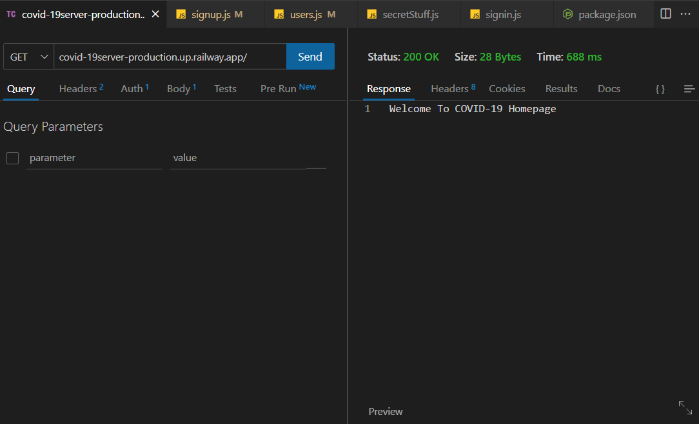
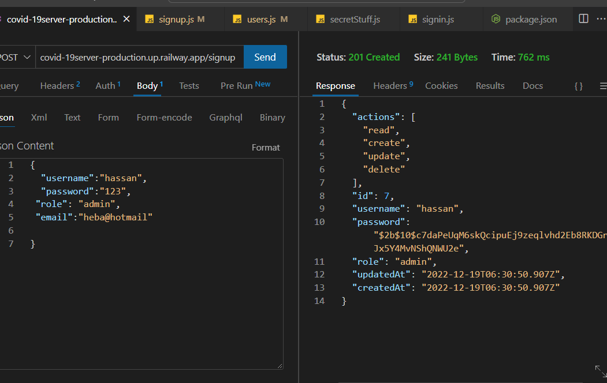
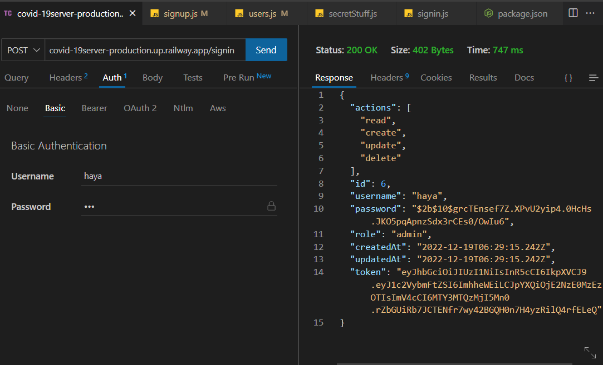
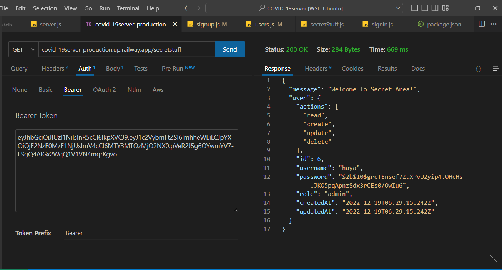
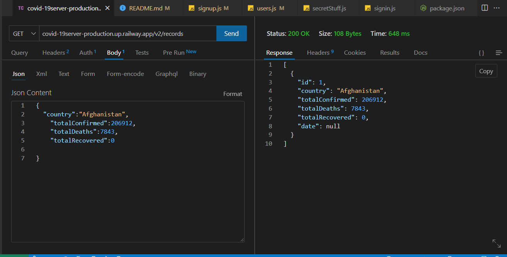
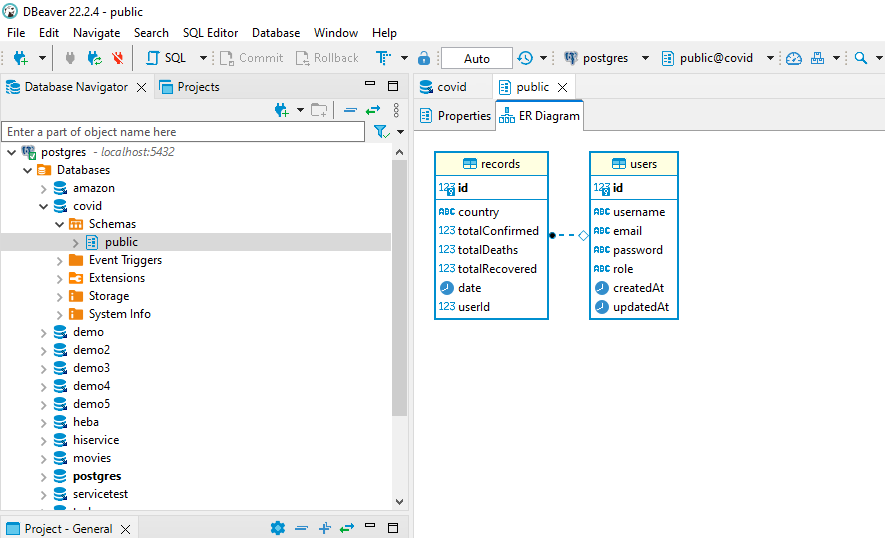

# COVID-19server
## Deploy Link 
[RailLive Covid-19 ](https://covid-19server-production.up.railway.app/)
## Covid-19 App Screen Shot

## Dependencies
* base-64
* bcrypt
* cors
* dotenv
* express
* jest
* jsonwebtoken
* pg
* nodemon
* sequelize
* path
* pg
* sequelize
* supertest
* sqlite3
## Installation

- covid-19 requires Node.js v14+ to run.

- Install the dependencies and devDependencies and start the server.

1. cd covid-19

2. npm i

3. npm start

## Using a Database? Make an Database Schema Diagram

* we prepare our database and tables as shown in the pic

